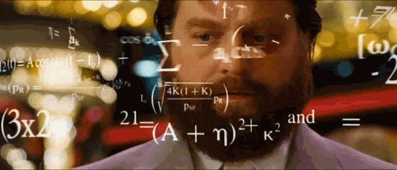

```{r setup, include=FALSE}
library(knitr)
library(fontawesome)

options(htmltools.dir.version = FALSE)
knitr::opts_chunk$set(warning = FALSE, message = FALSE)

```

layout: true

<div class="my-footer"><span>https://swampthingecology.org</span></div>

<!-- this adds the link footer to all slides, depends on my-footer class in css-->
<!-- used https://arm.rbind.io/slides/xaringan.html to help build this presentation --->
<!--
```{r xaringan-logo, echo=FALSE}
#xaringanExtra::use_logo(
#  image_url = "D:/__logo/SWE_logo.png"
#)
```
--->

---
name: xaringan-title
class: left, middle
background-image: url("D:/Photos/20180421_BCNPScenicTrail/DSCN7227.jpg")
background-size: cover

# Multivariate Statistics Tips and Tricks

### .fancy[<font color="white">Intro to PCA</font>]

<!--.large[<font color="white">Paul Julian, PhD | `r format(Sys.Date(),"%B %d,%Y")`</font>]-->

.large[<font color="white">Paul Julian, PhD | `r format(as.Date("2020-04-02"),"%B %d, %Y")`</font>]

<!-- this ends up being the title slide since seal = FALSE-->

---
class: middle, inverse

```{r 0, out.width="75%",echo=FALSE,fig.align="center"}
knitr::include_graphics("./_gifs/thankyou.gif")
```

- Thanks to Dr Zarah Pattison and the Modelling, Evidence and Policy Research group for the invitation.

- Today's discussion will be loosely based on a recent [blog](https://swampthingecology.org/blog/pca-basics-in-rstats/) post on Principal Component Analysis.

.footnote[
[1] https://swampthingecology.org/blog/pca-basics-in-rstats/
]

---
name: intro
class: left

### About Me

.left-column[

```{r, out.width="110%",echo=FALSE,fig.align="center"}
knitr::include_graphics("D:/Photos/ProfilePics/6milecypressNorth.jpg")
```
]

.right-column[
- Not a statistician (just play one on TV)
- Wetland Biogeochemist
- PhD in Soil and Water Science (University of Florida)
- Likes long walks on the beach...or a wetland...


### .fancy[Find me at...]

[`r fa(name = "twitter")` @swampthingpaul](http://twitter.com/swampthingpaul)  
[`r fa(name = "github")` @swampthingpaul](http://github.com/swampthingpaul)  
[`r fa(name = "chrome")` swampthingecology.org](https://swampthingecology.org)  
[`r fa(name = "envelope")` pauljulianphd@gmail.com](mailto:pauljulianphd@gmail.com)
]
---
name: ordinations
class:left


## Ordination Analysis

A family of statistical analyses used to order multivariate data. 

--

Some common analyses include:

--
- **Principal Component Analysis (PCA)**

--

- Correspondance analysis (CA) and its derivatives
  - detrended CA
  - canonical CA

--

- Redundancy Analysis (RDA)

--

- Non-Metric Multidimensional Scaling (NMDS)

--

- Bray-Curtis Ordination <!--https://www.sciencedirect.com/science/article/pii/S0065250408601683--->

---
name: PCA
class: left, middle

## Principal Component Analysis


.pull-left[

*"A rose by any other name ..."*


```{r, out.width="80%",echo=FALSE,fig.align="center",cap="BBC Two Gardeners' World Ep 16 (2019) cover."}
knitr::include_graphics("https://ichef.bbci.co.uk/images/ic/640x360/p07ffzqb.jpg")
```

]

--
.pull-right[

I have heard PCA called many names: 
- ***unsupervised feature extraction***
- ***dimensionality reduction***
- statistical hand waving
- mass plotting
- magic
]

---
name: PCA2
```{r, out.width="65%",echo=FALSE,fig.align="center"}

```

* Rooted in linear algebra, its the simplest of the true eigenvector-based multivariate analyses.

--

* Creates weighted linear combination of the original varables to capture as much variance in the dataset whilest eliminating correlations/redundancies.

--

* Reveals the internal structure of the data in a way that best explains the variance in the data.

---
name: PCA3
class: left
## Principal Component Analysis

Typically when talking about PCA you hear terms like *loading*, *eigenvectors* and *eigenvalues*.

--

- **Eigenvectors** are unit-scaled loadings. Mathematically, they are the column sum of squared loadings for a factor. It conceptually represents the amount of variance accounted for by a given factor.

--

- **Eigenvalues** is the measure of variation in the total sample accounted for by each factor. Computationally, a factor’s eigenvalues are determined as the sum of its squared factor loadings for all the variables. The ratio of eigenvalues is the ratio of explanatory importance of the factors with respect to the variables (remember this for later).

--

- **Factor Loadings** is the correlation between the original variables and the factors. Analogous to Pearson’s r, the squared factor loadings is the percent of variance in that variable explained by the factor

---
names: PCA4
class: left
## Principal Component Analysis

Imagine a multivariate dataset...lets say lake water quality data

```{r data example,echo=F}
dat<-read.csv("D:/_GitHub/PCA_Workshop/data/lake_data.csv")
library(AnalystHelper)
library(reshape)

dat.xtab=cast(dat,Station.ID+LAKE+Date.EST~param,value="HalfMDL",mean)

# Cleaning up/calculating parameters
dat.xtab$TN=with(dat.xtab,TN_Combine(NOx,TKN,TN))
dat.xtab$DIN=with(dat.xtab, NOx+NH4)

# More cleaning of the dataset 
vars=c("Alk","Cl","Chla","DO","pH","SRP","TP","TN","DIN")
dat.xtab=dat.xtab[,c("Station.ID","LAKE","Date.EST",vars)]

head(dat.xtab[,c("Station.ID","LAKE","Date.EST","Alk","Chla","SRP","TP","TN","DIN")],4L)

```

--

- or any other dataset with several different variables


--
PCA is a way to reduce the dimensionality of the data and determine what *statistically* matters. 


--

Its beyond a data winnowing technique it also shows similarity (or difference) between groups and relationships between variables.

---

name: PCA5
class: left
## Principal Component Analysis

--

### *Disadvantages*
.pull-left[
- PCA is data hungry

```{r, out.width="75%",echo=FALSE,fig.align="center"}

```
]
--

.pull-right[
- Fall victim to the curse of dimensionality.
  - As dimensionality increases, effectiveness of the data decreases.
  - As dimensions are added to a data set, the distance between points increases in the multivariate space. 


```{r, out.width="80%",echo=FALSE,fig.align="center"}
knitr::include_graphics("https://pvsmt99345.i.lithium.com/t5/image/serverpage/image-id/57591i4BEAC37E774C8C3B/image-size/large?v=1.0&px=999")
```
<!-- https://community.alteryx.com/t5/Data-Science-Blog/Tidying-up-with-PCA-An-Introduction-to-Principal-Components/ba-p/382557 --->

]
---
name: PCA6
class:left

## PCA Assumptions

--
- **Multiple Variables:** An obvious assumption, a multivarate analysis needs multiple variables. Meant for continuous variables, but ordinal varables are frequently used. 

--

- **Sample Adequacy:** Size matters!! A general rule of thumbs has been a minimum of 150 cases (ie rows), or 5 to 10 cases per variable. 

--

- **Linearity:** It is assumed that the relationships between variables are linearly related. The basis of this assumption is rooted in the fact that PCA is based on Pearson correlation coefficients and therefore the assumptions of Pearson’s correlation also hold true. Generally, this assumption is somewhat relaxed.

--

- **Outliers:**  Outliers can have a disproportionate influence on the resulting component computation. Since principal components are estimated by essentially re-scaling the data retaining the variance outlier could skew the estimate of each component within a PCA. 

---
name: PCA7
class: left

## PCA Assumptions

.pull-left[
- One more thing about outliers.

- Another way to visualize how PCA is performed is that it uses rotation of the original axes to derive a new axes, which maximizes the variance in the data set. 
]

--
.pull-right[

In 2D this looks like this:

```{r,echo=FALSE,dpi=200,fig.width=4,fig.height=3.5,fig.align='center'}
set.seed(1)
x.val=sample(seq(-1,1,length.out=1000),100)*runif(100)
y.val=x.val*runif(100,0.25,1.25)
y.val=ifelse(y.val>0.2|y.val<(-0.2),y.val,runif(100,-0.2,0.2))

par(family="serif",mar=c(0.5,0.5,0.5,0.5),oma=c(0.1,0.1,0.1,0.1),xpd=NA);
plot(x.val,y.val,axes=F,ylab=NA,xlab=NA,type="n",ylim=c(-1,1),xlim=c(-1,1))
abline(h=0,v=0)
points(x.val,y.val,pch=21,bg=adjustcolor("dodgerblue1",0.5),cex=1.25,lwd=0.01)
PCA1=lm(y.val~x.val)
PCA1.pred=predict(PCA1,data.frame(x.val=seq(min(x.val),max(x.val),length.out=100)))
lines(seq(min(x.val),max(x.val),length.out=100),PCA1.pred,col="red",lwd=2.5)
text(max(x.val),max(PCA1.pred),"PCA1",pos=4,font=2)
angle=atan(coef(PCA1)[2])
angle.new=angle+(90*pi/180)

lines(seq(min(x.val),max(x.val),length.out=100),seq(-0.1,0.1,length.out=100)*tan(angle.new),col="red",lwd=2)
text(min(x.val),max(seq(-0.1,0.1,length.out=100)*tan(angle.new)),"PCA2",pos=2,font=2)
#abline(a=0,b=tan(-45*pi/180))
```
]

---
name: R-time
class: left

## R you ready?

PCA Analysis can be done through a variety of `R` Packages. Each have there own nuisances...

--

- `prcomp()` and `princomp()` are from the bases `stats` package. The quickest, easiest and most stable method

--

- `PCA()` in the `FactoMineR` package.

- `dubi.pca()` in the `ade4` package.

- `acp()` in the `amap` package.

- `rda()` in the `vegan` package. More on this later. 

--

Personally, I only have experience working with `prcomp`, `princomp` and `rda` in the following examples we will be using `rda()` but this can be adapted to the other analyses.

  - `rda()` performs redundancy analysis. Normally RDA is used for *“constrained ordination”* but without predictors, functionally RDA == PCA

---
name: R-time2
class: left

* `R` packages used today include
  - `AnalystHelper` 
  - `reshape`
  - `vegan`
  - `REdaS`
  
```{r, warning=F}
library(AnalystHelper)
library(reshape)
library(vegan)
library(REdaS)
```

* For demonstration purposes we will use the dataset I introduced earlier [`.../data/lake_data.csv`](https://github.com/SwampThingPaul/PCA_Workshop/tree/ba3ca18155abe558e65d32ac2872d0ad27a33fad/data).
  - `dat<-read.csv(".../data/lake_data.csv")`

```{r,include=F}
dat<-read.csv("D:/_GitHub/PCA_Workshop/data/lake_data.csv") 
```


.footnote[
[1] https://github.com/SwampThingPaul/AnalystHelper

[2] https://github.com/SwampThingPaul/PCA_Workshop
]

???
- Here we will use a dataset I put together quickly. 
- If we have time and if anyone is willing to explore their own data with the group. 
- Or have questions about their data and PCA type analyses.

---
name: R-time3
class: left

Currently the data is in rows, we need it in columns (data massaging). 

```{r}
# Cross tabulate the data based on parameter name
dat.xtab <- cast(dat,Station.ID+LAKE+Date.EST~param,value="HalfMDL",mean)

# Cleaning up/calculating parameters
dat.xtab$TN <- with(dat.xtab,TN_Combine(NOx,TKN,TN))
dat.xtab$DIN <- with(dat.xtab, NOx+NH4)

# More cleaning of the dataset 
vars <- c("Alk","Cl","Chla","DO","pH","SRP","TP","TN","DIN")
dat.xtab <- dat.xtab[,c("Station.ID","LAKE","Date.EST",vars)]

head(dat.xtab[,c("Station.ID","LAKE",vars)],4L)

```

---
name: R-time4
class: left

* `NA` values are a no go in PCA analyses...some more cleaning.

* How many `NA`s do we have? 

```{r}
#How many rows of data do we have?
nrow(dat.xtab)

#How many rows contain NAs
nrow(na.omit(dat.xtab))
```

That is `r nrow(dat.xtab)-nrow(na.omit(dat.xtab))` rows removed due to incomplete data.
  - could narrow the parameters you want to look at to avoid excessive data culling.

```{r}
dat.xtab <- na.omit(dat.xtab)
```


???
725 rows of data

515 rows with NAs omitted

210 rows removed due to incomplete data. (could narrow the parameters you want to look at to avoid excessive data culling.)

---
name: R-time5
class: left

Lets take a quick look at the data...

--

```{r,echo=FALSE,dpi=175,fig.width=7.5,fig.height=5.25,fig.align='center',fig.cap="Scatterplot of all data for the example `dat.xtab` dataset."}
par(family="serif",mar=c(1,1.5,0.1,0.1),oma=c(3,3.5,0.75,0.5));
layout(matrix(1:72,8,8))

params=c(names(dat.xtab)[4:12])
axis.lab=c("Alk\n(mg L\u207B\u00B9)","Cl\n(mg L\u207B\u00B9)", "Chl-a\n(\u03BCg L\u207B\u00B9)","DO\n(mg L\u207B\u00B9)","pH\n(unitless)","SRP\n(mg L\u207B\u00B9)","TP\n(mg L\u207B\u00B9)", "TN\n(mg L\u207B\u00B9)","DIN\n(mg L\u207B\u00B9)")

for(j in 1:8){
  if(j!=1){for(k in 1:(j-1)){plot(0:1,0:1,axes=F,type="n",ylab=NA,xlab=NA)}}

params2=params[-1:-j]
axis.lab2=axis.lab[-1:-j]
xlim.val=c(0,175);by.x=50;xmaj=seq(xlim.val[1],xlim.val[2],by.x);xmin=seq(xlim.val[1],xlim.val[2],by.x/2)
lim.min=c(0,0,0,0,5,0,0,0,0)
lim.max=c(175,80,125,13,10,0.15,1.5,10,0.8);by.val=c(75,40,75,6,2.5,0.06,0.75,5,0.4)
for(i in 1:length(params2)){
  xlim.val=c(lim.min[j],lim.max[j]);by.x=by.val[j];xmaj=seq(xlim.val[1],xlim.val[2],by.x);xmin=seq(xlim.val[1],xlim.val[2],by.x/2)
  ylim.val=c(lim.min[-1:-j][i],lim.max[-1:-j][i]);by.y=by.val[-1:-j][i];ymaj=seq(ylim.val[1],ylim.val[2],by.y);ymin=seq(ylim.val[1],ylim.val[2],by.y)
  plot(dat.xtab[,params[j]],dat.xtab[,params2[i]],xlim=xlim.val,ylim=ylim.val,axes=F,type="n",ylab=NA,xlab=NA)
  abline(h=ymaj,v=xmaj,lty=3,col="grey")
  points(dat.xtab[,params[j]],dat.xtab[,params2[i]],pch=21,bg=adjustcolor("dodgerblue1",0.25),col=adjustcolor("grey",0.5),lwd=0.01,cex=0.8)
  if(i==length(params2)){axis_fun(1,xmaj,xmin,format(xmaj),cex=0.8,line=-0.75)}else{axis_fun(1,xmaj,xmin,NA,cex=0.8,line=-0.5)}
  if(j==1){axis_fun(2,ymaj,ymin,format(ymaj),cex=0.8)}else{axis_fun(2,ymaj,ymin,NA,cex=0.8)}
  box(lwd=1)
  if(j==1){mtext(side=2,line=2.25,cex=0.8,axis.lab2[i])}
}
mtext(side=1,line=2.5,cex=0.8,axis.lab[j])
}

```

---
name: R-time6
class: left

* Lets check the measure of sampling adequacy.

--

* Some have suggested to perform a sampling adequacy analysis such as Kaiser-Meyer-Olkin (KMO) Measure of Sampling Adequacy. 
  - However, KMO is less a function of sample size adequacy as its a measure of the suitability of the data for factor analysis, which leads to the next point.

--

```{r, message=F,warning=F,echo=T}

KMOS(dat.xtab[,vars])

```

Based on the KMO analysis, the KMO-Criterion of the dataset is 0.7, well above the suggested 0.5 threshold.

---
name: R-time7
class: left

* Lets do another check of the data using Bartlett's Test of Sphericity.

--
   - Bartlett's Test of Sphericity $\neq$ Bartlett’s Test for Equality of Variances

--

* Test of Sphericity tests whether the data comes from a multivariate normal distribution with zero covariances.
  - compares an observed correlation matrix to the identity matrix
$$
\begin{bmatrix}
1 & 0 & 0\\
0 & 1 & 0\\
0 & 0 & 1
\end{bmatrix}
$$

--

```{r}
# Bartlett's Test Of Sphericity
bart_spher(dat.xtab[,vars])
```

* The data is significantly different from an identity matrix ($H_0$ : all off-diagonal correlations are zero) and suitable for PCA.

---
name: R-time8
class: left, inverse

### Now that the data is cleaned and checked ... 

--

### <center> .fancy[... lets do some PCA!! ]</center>

```{r, out.width="100%",echo=FALSE,fig.align="center"}
knitr::include_graphics("./_gifs/party.gif")
```

---
name: R-time9
class: left

PCA analysis is pretty straight forward. 

```{r}
dat.xtab.pca <- rda(dat.xtab[,vars],scale = T)
```

--
  - Using `rda(... scale = T)` without predictors and scaled functionally produces a PCA. Can also compare usin `princomp()`. 
  
--

Now lets see the importance and variance explained by each component by extracting some important information.

* The quickest way is to use `summary(dat.xtab.pca)$cont`.

```{r,echo=FALSE}
summary(dat.xtab.pca)$cont
```

---
name: R-time10
class: left

To understand what all this means lets extract the information ourselves. 

```{r}
#Extract eigenvalues (see definition above)
eig <- dat.xtab.pca$CA$eig

# Percent of variance explained by each compoinent
variance <- eig*100/sum(eig)

# The cumulative variance of each component (should sum to 1)
cumvar <- cumsum(variance)

# Combine all the data into one data.frame
eig.pca <- data.frame(eig = eig, variance = variance,cumvariance = cumvar)
```

--

* To double check, compare `summary(dat.xtab.pca)$cont` with `eig.pca` ... they should be the same.

--

* What does the component eigenvalue and percent variance mean?

--

* More importantly what does it tell us about our data?

--

This information helps tell us how much variance is explained by the components. It also helps identify which components should be used moving forward.

---
name: R-time11
class: left

```{r, out.width="80%",echo=FALSE,fig.align="center"}
knitr::include_graphics("./_gifs/guidelines.gif")
```

Generally there are two general rules: 

--

1. Pick components with eignvalues of at least 1. 
  - This is called the Kaiser rule. 

--

2. The selected components should be able to describe at least 80% of the variance. 
  - If you look at `eig.pca` you'll see that based on these criteria component 1, 2 and 3 are the components to focus on as they are enough to describe the data.

--

A scree plot displays these data and shows how much variation each component captures from the data. 

---
name: R-time12
class: left

## Scree plots

```{r,echo=FALSE,dpi=150,fig.width=8,fig.height=4,fig.retina=1,fig.align='center',fig.cap="Left: Scree plot of eigenvalues for each prinicipal component with the Kaiser threshold identified. Right: Scree plot of the variance and cumulative variance for each priniciple component."}
layout(matrix(1:2,1,2))
par(family="serif",mar=c(1,2,0.1,1),oma=c(3,1,0.75,0.5));

ylim.val=c(0,5);by.y=1;ymaj=seq(ylim.val[1],100,by.y);ymin=seq(ylim.val[1],100,by.y/2)
x=barplot(eig.pca$eig,ylim=ylim.val,col="grey",yaxt="n")
abline(h=ymaj,lty=3,col="grey")
x=barplot(eig.pca$eig,ylim=ylim.val,col="grey",yaxt="n",add=T)
abline(h=1,lty=2,col="red",lwd=2)
axis_fun(1,line=-0.7,x,x,seq(1,length(x),1),0.7)
axis_fun(2,ymaj,ymin,ymaj,0.75);box(lwd=1)
mtext(side=1,line=1.5,"Principal Components")
mtext(side=2,line=1.5,"Eigenvalue")

ylim.val=c(0,110);by.y=25;ymaj=seq(ylim.val[1],100,by.y);ymin=seq(ylim.val[1],100,by.y/2);#set y limit and delineates the major and minor ticks
x=barplot(eig.pca$variance,ylim=ylim.val,col="white",border=0,yaxt="n")# inital plot to get the measurements
abline(h=ymaj,lty=3,col="grey")#makes vertical lines from y axis
x=barplot(eig.pca$variance,ylim=ylim.val,col="grey",yaxt="n",add=T)# the real plot that matters
lines(x,eig.pca$cumvariance,col="indianred1",lwd=2)# adds the cumulative variance for each factor
points(x,eig.pca$cumvariance,pch=21,bg="indianred1",cex=1.25)
abline(h=80,lty=2,col="red",lwd=2)
axis_fun(1,line=-0.7,x,x,seq(1,length(x),1),0.7)
axis_fun(2,ymaj,ymin,ymaj,0.75);box(lwd=1)
mtext(side=1,line=1.5,"Principal Components")
mtext(side=2,line=1.75,"Percentage of Variances")
legend.text=c("Absolute","Cumulative");#helper vaiable for legend
pt.col=c("grey","indianred1")#helper vaiable for legend
legend("topleft",legend=legend.text,pch=c(22,21),pt.bg=pt.col,col=c("black",pt.col[2]),lty=c(0,1),lwd=1.5,pt.cex=1.5,ncol=2,cex=1,bty="n",y.intersp=1,x.intersp=0.75,xpd=NA,xjust=0.5,text.col="white")
legend("topleft",legend=legend.text,pch=c(22,21),pt.bg=pt.col,col="black",lty=0,lwd=0.5,pt.cex=1.55,ncol=2,cex=1,bty="n",y.intersp=1,x.intersp=0.75,xpd=NA,xjust=0.5)

```

???
`eig.pca$eig` plot the components (left plot)

`eig.pca$variance` and `eig.pca$cumvariance` plots the variance (right plot)

---
name: R-time13
class: left

## Biplot

Now that we know which components are important, lets put together our biplot and extract components. To extract out components and specific loadings we can use the `scores()` function in the `vegan` package. 

--

  - It is a generic function to extract scores from `vegan` oridination objects such as RDA, CCA, etc. 
   - This function also seems to work with `prcomp` and `princomp` PCA functions in `stats` package.

--

```{r}
scrs<-scores(dat.xtab.pca,display=c("sites","species"),choices=c(1,2,3));
```

--

  - `scrs` is a list of two item, species and sites. Species corresponds to the columns of the data and sites correspond to the rows. 
   - Use `choices` to extract the components you want, in this case we want the first three components. Now we can plot the scores.

---
name: R-time14
class: left

## Biplot

```{r,echo=FALSE,fig.width=8,fig.height=4,fig.retina=1,dpi=150,fig.align='center',fig.cap="PCA biplot of two component comparisons from the `data.xtab.pca` analysis."}

par(family="serif",mar=c(1,3,0.1,0.5),oma=c(3,1.5,0.75,0.5));
layout(matrix(1:2,1,2))

xlim.val=c(-0.5,1);by.x=0.5;xmaj=c(0,seq(xlim.val[1],xlim.val[2],by.x));xmin=seq(xlim.val[1],xlim.val[2],by.x/2);
ylim.val=c(-0.5,1);by.y=0.5;ymaj=c(0,seq(ylim.val[1],ylim.val[2],by.y));ymin=seq(ylim.val[1],ylim.val[2],by.y/2);
plot(xlim.val,ylim.val,type="n",yaxt="n",xaxt="n",ylab=NA,xlab=NA);
abline(h=0,v=0,lty=3,col="grey");
points(scrs$sites[,c(1,2)],pch=21,bg="grey",cex=1,lwd=0.5); #plots the points
#arrows(0,0,scrs$species[,1],scrs$species[,2],length = 0.05, angle = 15, code = 2,col="indianred1",lwd=1.5);# makes the arrows
#with(scrs,text(species[,1]-0.1,species[,2],labels=rownames(species),cex=0.75));#adds labels to the arrows; 
axis_fun(1,line=-0.5,xmaj,xmin,format(xmaj),1); #adds x axis ticks
axis_fun(2,ymaj,ymin,format(ymaj),1); #adds y axis ticks
mtext(side=1,line=1.8,paste0("PCA 1 (",round(eig.pca$variance[1],1),"%)"));#adds x axis label with percent variance
mtext(side=2,line=2.25,paste0("PCA 2 (",round(eig.pca$variance[2],1),"%)"));#adds y axis label with percent variance


xlim.val=c(-1,1.5);by.x=0.5;xmaj=c(0,seq(xlim.val[1],xlim.val[2],by.x));xmin=seq(xlim.val[1],xlim.val[2],by.x/2);
ylim.val=c(-1.5,1.5);by.y=0.5;ymaj=c(0,seq(ylim.val[1],ylim.val[2],by.y));ymin=seq(ylim.val[1],ylim.val[2],by.y/2);

plot(xlim.val,ylim.val,type="n",yaxt="n",xaxt="n",ylab=NA,xlab=NA);
abline(h=0,v=0,lty=3,col="grey");
points(scrs$sites[,c(1,3)],pch=21,bg="grey",cex=1,lwd=0.5); 
axis_fun(1,line=-0.5,xmaj,xmin,format(xmaj),1); 
axis_fun(2,ymaj,ymin,format(ymaj),1); 
mtext(side=1,line=1.8,paste0("PCA 1 (",round(eig.pca$variance[1],1),"%)"));
mtext(side=2,line=2.25,paste0("PCA 3 (",round(eig.pca$variance[3],1),"%)"));
```


---
name: R-time15
class: left

```{r,echo=FALSE,fig.width=7.5,fig.height=3.25,fig.retina=1,dpi=150,fig.align='center',fig.cap="PCA biplot of two component comparisons from the `data.xtab.pca` analysis with rescaled loadings."}

par(family="serif",mar=c(1,3,0.1,0.5),oma=c(2.5,1.5,0.75,0.5));
layout(matrix(1:2,1,2))

labs=c("Alk","Cl","Chl-a","DO","pH","SRP","TP","TN","DIN")
xlim.val=c(-0.5,1);by.x=0.5;xmaj=c(0,seq(xlim.val[1],xlim.val[2],by.x));xmin=seq(xlim.val[1],xlim.val[2],by.x/2);
ylim.val=c(-0.5,1);by.y=0.5;ymaj=c(0,seq(ylim.val[1],ylim.val[2],by.y));ymin=seq(ylim.val[1],ylim.val[2],by.y/2);
plot(xlim.val,ylim.val,type="n",yaxt="n",xaxt="n",ylab=NA,xlab=NA);
abline(h=0,v=0,lty=3,col="grey");
points(scrs$sites[,c(1,2)],pch=21,bg=adjustcolor("grey",0.25),col=adjustcolor("grey",0.75),cex=1,lwd=0.01); #plots the points
arrows(0,0,scrs$species[,1]/3,scrs$species[,2]/3,length = 0.05, angle = 15, code = 2,col="indianred1",lwd=1.5);# makes the arrows
with(scrs,text((species[,1]+0.15)/3,species[,2]/3,labels=labs,cex=0.75,font=3));#adds labels to the arrows; 
axis_fun(1,line=-0.5,xmaj,xmin,format(xmaj),1); #adds x axis ticks
axis_fun(2,ymaj,ymin,format(ymaj),1); #adds y axis ticks
mtext(side=1,line=1.8,paste0("PCA 1 (",round(eig.pca$variance[1],1),"%)"));#adds x axis label with percent variance
mtext(side=2,line=2.25,paste0("PCA 2 (",round(eig.pca$variance[2],1),"%)"));#adds y axis label with percent variance


xlim.val=c(-1,1.5);by.x=0.5;xmaj=c(0,seq(xlim.val[1],xlim.val[2],by.x));xmin=seq(xlim.val[1],xlim.val[2],by.x/2);
ylim.val=c(-1.5,1.5);by.y=0.5;ymaj=c(0,seq(ylim.val[1],ylim.val[2],by.y));ymin=seq(ylim.val[1],ylim.val[2],by.y/2);
plot(xlim.val,ylim.val,type="n",yaxt="n",xaxt="n",ylab=NA,xlab=NA);
abline(h=0,v=0,lty=3,col="grey");
points(scrs$sites[,c(1,3)],pch=21,bg=adjustcolor("grey",0.25),col=adjustcolor("grey",0.75),cex=1,lwd=0.01); #plots the points
arrows(0,0,scrs$species[,1]/2,scrs$species[,3]/2,length = 0.05, angle = 15, code = 2,col="indianred1",lwd=1.5);# makes the arrows
with(scrs,text((species[,1]+0.15)/2,species[,3]/2,labels=labs,cex=0.75,font=3));#adds labels to the arrows; 
axis_fun(1,line=-0.5,xmaj,xmin,format(xmaj),1); 
axis_fun(2,ymaj,ymin,format(ymaj),1); 
mtext(side=1,line=1.8,paste0("PCA 1 (",round(eig.pca$variance[1],1),"%)"));
mtext(side=2,line=2.25,paste0("PCA 3 (",round(eig.pca$variance[3],1),"%)"));
```

--

Typically when you see a PCA biplot, you also see arrows of each variable. This is commonly called loadings and can interpreted as:

* When two vectors are close, forming a small angle, the variables are typically positively correlated.

* If two vectors are at an angle 90`r paste("\u00b0")` they are typically not correlated. 

* If two vectors are at a large angle say in the vicinity of 180`r paste("\u00b0")` they are typically negatively correlated. 

---
name: R-time16
class: left

You can take this one even further by showing how each lake falls in the ordination space by joining the `sites` to the original data frame. This is also how you use the derived components for further analysis.

--
```{r}
dat.xtab=cbind(dat.xtab,scrs$sites)

head(dat.xtab,3L)
```

---
name: R-time17
class: left

```{r,echo=FALSE,fig.width=8,fig.height=4.5,dpi=150,fig.retina=1,fig.align='center',fig.cap="PCA biplot of two component comparisons from the `data.xtab.pca` analysis with rescaled loadings and Lakes identified."}

par(family="serif",mar=c(1.5,3,0.1,0.5),oma=c(0,1.5,0.75,0.5));
layout(matrix(c(1:2,3,3),2,2,byrow=T),heights=c(1,0.3))

#length(unique(dat.xtab$LAKE))
cols=wesanderson::wes_palette("Zissou1",6,"continuous")

labs=c("Alk","Cl","Chl-a","DO","pH","SRP","TP","TN","DIN")
xlim.val=c(-0.5,1);by.x=0.5;xmaj=c(0,seq(xlim.val[1],xlim.val[2],by.x));xmin=seq(xlim.val[1],xlim.val[2],by.x/2);
ylim.val=c(-0.5,1);by.y=0.5;ymaj=c(0,seq(ylim.val[1],ylim.val[2],by.y));ymin=seq(ylim.val[1],ylim.val[2],by.y/2);
plot(xlim.val,ylim.val,type="n",yaxt="n",xaxt="n",ylab=NA,xlab=NA);
abline(h=0,v=0,lty=3,col="grey");
for(i in 1:6){
  with(subset(dat.xtab,LAKE==unique(dat.xtab$LAKE)[i]),points(PC1,PC2,pch=21,bg=adjustcolor(cols[i],0.25),col=adjustcolor(cols[i],0.5),lwd=0.1,cex=1.25))
}
arrows(0,0,scrs$species[,1]/3,scrs$species[,2]/3,length = 0.05, angle = 15, code = 2,col="indianred1",lwd=1.5);# makes the arrows
with(scrs,text((species[,1]+0.15)/3,species[,2]/3,labels=labs,cex=0.75,font=3));#adds labels to the arrows; 
axis_fun(1,line=-0.5,xmaj,xmin,format(xmaj),1); #adds x axis ticks
axis_fun(2,ymaj,ymin,format(ymaj),1); #adds y axis ticks
mtext(side=1,line=1.8,paste0("PCA 1 (",round(eig.pca$variance[1],1),"%)"));#adds x axis label with percent variance
mtext(side=2,line=2.25,paste0("PCA 2 (",round(eig.pca$variance[2],1),"%)"));#adds y axis label with percent variance


xlim.val=c(-1,1.5);by.x=0.5;xmaj=c(0,seq(xlim.val[1],xlim.val[2],by.x));xmin=seq(xlim.val[1],xlim.val[2],by.x/2);
ylim.val=c(-1.5,1.5);by.y=0.5;ymaj=c(0,seq(ylim.val[1],ylim.val[2],by.y));ymin=seq(ylim.val[1],ylim.val[2],by.y/2);
plot(xlim.val,ylim.val,type="n",yaxt="n",xaxt="n",ylab=NA,xlab=NA);
abline(h=0,v=0,lty=3,col="grey");
for(i in 1:6){
  with(subset(dat.xtab,LAKE==unique(dat.xtab$LAKE)[i]),points(PC1,PC3,pch=21,bg=adjustcolor(cols[i],0.25),col=adjustcolor(cols[i],0.5),lwd=0.1,cex=1.25))
}
arrows(0,0,scrs$species[,1]/2,scrs$species[,3]/2,length = 0.05, angle = 15, code = 2,col="indianred1",lwd=1.5);# makes the arrows
with(scrs,text((species[,1]+0.15)/2,species[,3]/2,labels=labs,cex=0.75,font=3));#adds labels to the arrows; 
axis_fun(1,line=-0.5,xmaj,xmin,format(xmaj),1); 
axis_fun(2,ymaj,ymin,format(ymaj),1); 
mtext(side=1,line=1.8,paste0("PCA 1 (",round(eig.pca$variance[1],1),"%)"));
mtext(side=2,line=2.25,paste0("PCA 3 (",round(eig.pca$variance[3],1),"%)"));

plot(0:1,0:1,axes=F,type="n",ylab=NA,xlab=NA)
legend(0.5,0,legend=unique(dat.xtab$LAKE),
       pch=c(21),
       col=adjustcolor(cols,0.5),
       pt.bg=adjustcolor(cols,0.25),
       lwd=c(0.01),lty=c(NA),pt.cex=1.5,ncol=3,cex=0.75,bty="n",y.intersp=1.75,x.intersp=0.75,xpd=NA,xjust=0.5,yjust=0.1)

```

* You can extract a lot of great information from these plots and the underlying component data but immediately we see how the different lakes are group and how differently the lakes are loaded with respect to the different variables. 

---
name: end-slide
class: end-slide, bottom, left, inverse
background-image: url("D:/Photos/20180805_BCNPScenicTrail_Nth/DSCN8093.jpg")
background-size: cover


[`r fa(name = "envelope",fill="white")` pauljulianphd@gmail.com](mailto:pauljulianphd@gmail.com)

[`r fa(name = "github",fill="white")` github.com/SwampThingPaul/PCA_Workshop](http://github.com/SwampThingPaul/PCA_Workshop)  


```{r,include=FALSE,eval=FALSE}
#from https://github.com/NBISweden/raukrtemplate

# manually run this to render this document to HTML
rmarkdown::render("presentation.Rmd")
# manually run this to convert HTML to PDF
#pagedown::chrome_print("presentation.html",output="presentation.pdf")
```